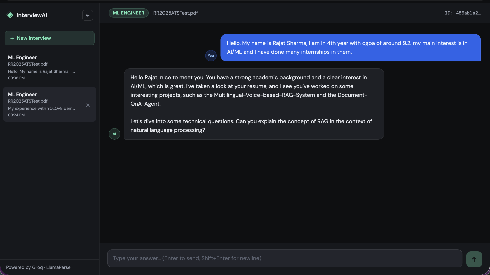

# InterviewAI - AI-Powered Technical Interview Simulator

An intelligent interview simulation platform that uses AI to conduct technical interviews based on a candidate's resume. The system parses resumes, generates relevant technical questions, and conducts interactive interviews with real-time feedback.

## 🚀 Features

- **Resume Parsing**: Upload PDF resumes and automatically extract key information using LlamaParse
- **Smart Question Generation**: AI-powered question generation based on candidate's skills and technologies
- **Interactive Interviews**: Real-time chat interface with an AI interviewer
- **Session Persistence**: Chat history saved and retrievable across sessions
- **Role-Based Interviews**: Support for multiple technical roles (Frontend, Backend, Data Science, ML, DevOps, etc.)
- **Vector Search**: Uses Chroma DB with HuggingFace embeddings for context retrieval
- **Answer Evaluation**: Automatic scoring of candidate responses (0-10 scale)

## Images


## 🛠️ Tech Stack

### Frontend
- React 18
- CSS Modules
- LocalStorage for session persistence

### Backend
- FastAPI (Python)
- LlamaParse for PDF parsing
- Groq LLM API (Llama 3.3 70B)
- Chroma DB for vector storage
- SQLite for chat memory
- LangChain for LLM orchestration
- HuggingFace Embeddings

## 📋 Prerequisites

- Node.js (v16 or higher)
- Python 3.9 or higher
- Groq API Key
- LlamaCloud API Key

## 🔧 Installation

### 1. Clone the Repository

```bash
git clone <your-repo-url>
cd interviewai
```

### 2. Backend Setup

```bash
# Navigate to backend directory
cd backend

# Create virtual environment
python -m venv venv

# Activate virtual environment
# On macOS/Linux:
source venv/bin/activate
# On Windows:
venv\Scripts\activate

# Install dependencies
pip install fastapi uvicorn python-multipart
pip install llama-cloud langchain-chroma langchain-huggingface
pip install langchain-groq langchain-core
pip install chromadb sentence-transformers
```

### 3. Environment Variables

Create a `.env` file in the backend directory:

```env
GROQ_API_KEY=your_groq_api_key_here
LLAMA_API=your_llamacloud_api_key_here
MODEL_NAME=model_name_from_groq
```

### 4. Frontend Setup

```bash
# Navigate to frontend directory
cd frontend

# Install dependencies
npm install
```

## 🚀 Running the Application

### 1. Start the Backend Server

```bash
cd backend
uvicorn main:app --reload --port 8000
```

The backend will run at `http://localhost:8000`

### 2. Start the Frontend Development Server

```bash
cd frontend
npm run dev
```
### 3. Access the Application

Open your browser and navigate to `http://localhost:3000`

## 📖 Usage Guide

### Starting a New Interview

1. Click **"New Interview"** button in the sidebar
2. Upload your resume (PDF format only)
3. Select the role you're applying for:
   - Frontend Engineer
   - Backend Engineer
   - Full Stack Engineer
   - Data Scientist
   - ML Engineer
   - DevOps Engineer
   - Product Manager
   - System Design
   - Mobile Engineer
   - Other (custom role)
4. Click **"Start Interview"**

### During the Interview

- The AI interviewer will ask questions based on your resume
- Type your answers in the chat input
- Press **Enter** to send, **Shift+Enter** for new lines
- The AI will evaluate your responses and provide follow-up questions
- The interview continues until all questions are asked

### Managing Sessions

- **View History**: All past interviews appear in the sidebar
- **Switch Sessions**: Click on any session to view its conversation
- **Delete Session**: Hover over a session and click the **×** button
- **Session Persistence**: Conversations are automatically saved and persist across page reloads

## 🔌 API Endpoints

### Backend API Routes

| Method | Endpoint | Description |
|--------|----------|-------------|
| POST | `/parse-resume` | Upload and parse PDF resume |
| POST | `/chat` | Send message and get AI response |
| GET | `/session/{chat_id}` | Retrieve full chat history for a session |

## 🗂️ Project Structure

```
interviewai/
├── backend/
│   ├── main.py              # FastAPI backend server
│   ├── documents/           # Chroma DB vector store
│   ├── chat_memory.db       # SQLite database
│   ├── uploads/             # Temporary file storage
│   └── requirements.txt     # Python dependencies
├── frontend/
│   ├── src/
│   │   ├── App.jsx          # Main React component
│   │   ├── App.css          # Styling
│   │   └── main.jsx         # Entry point
│   ├── index.html           # HTML template
│   └── package.json         # Node dependencies
└── README.md
```

## 🎯 How It Works

1. **Resume Processing**:
   - Uploaded PDF is sent to LlamaParse for markdown extraction
   - Keywords are extracted from the parsed resume
   - Technical questions are generated based on keywords and context

2. **Vector Search**:
   - Resume content is embedded using HuggingFace models
   - Stored in Chroma DB for semantic search
   - Used to retrieve relevant context for question generation

3. **Interview Flow**:
   - AI maintains conversation history
   - Questions are asked progressively
   - Each answer is evaluated (0-10 scale)
   - Interview ends when all questions are covered

4. **Data Persistence**:
   - Chat history stored in SQLite
   - Sessions saved to browser localStorage
   - Full conversation retrieval on session load


## 📊 Database Schema

### Conversations Table

| Column | Type | Description |
|--------|------|-------------|
| chat_id | TEXT PRIMARY KEY | Unique session identifier |
| history | TEXT | JSON array of chat messages |
| resume | TEXT | Parsed resume markdown |
| role | TEXT | Job role for the interview |
| questions | TEXT | JSON array of generated questions |
| verdict | TEXT | JSON array of answer scores |

---
